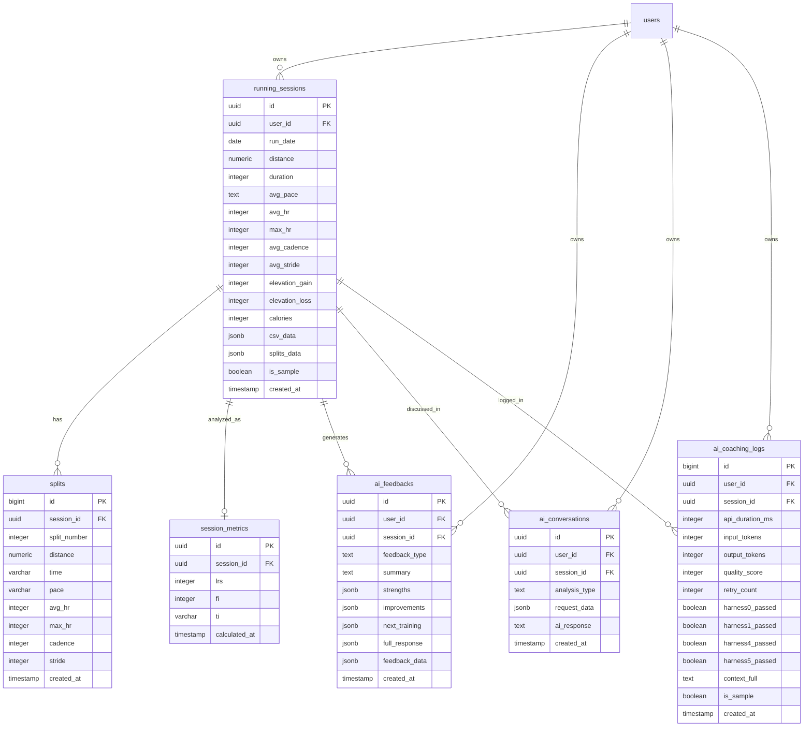

# ARCC Database ERD

**작성일**: 2026-05-01
**최종 갱신**: 2026-05-02 (Phase 3-7 B-1, B-3, B-4, B-5 반영)
**기준 커밋**: Phase 3-7 종결 커밋 (예정)
**Phase**: 3-7 complete (11/11)
**스키마 출처**: Supabase `public` schema, `information_schema` 기반 자동 추출

---

## 📐 전체 구조 (Mermaid Diagram)



---

## 📋 테이블 요약

| 테이블 | 역할 | 컬럼 수 | row 예시 (Phase 3-7 완료 시점) |
|---|---|---|---|
| `running_sessions` | 러닝 세션 마스터 (부모) | 17 ✅ | 4 |
| `splits` | 구간별 데이터 (1km, 2km...) | 11 | 31 |
| `session_metrics` | 분석 지표 (LRS/FI/TI) | 6 ✅ | 4 |
| `ai_feedbacks` | 정형화된 코칭 카드 | 11 | 3 |
| `ai_conversations` | AI 대화 히스토리 (차별화 핵심) | 7 | 0 |
| `ai_coaching_logs` | AI 호출 품질 모니터링 | 15 | 4 |

**총 컬럼 수**: 67 (Phase 3-7 B-1 완료 후 9개 감소: 76→67)

---

## 🌟 테이블별 상세

### 1. `running_sessions` (부모 테이블)

러닝 한 번 = 1 row. 모든 자식 테이블의 출발점.

| 컬럼 | 타입 | NULL | 설명 |
|---|---|---|---|
| **id** | uuid (PK) | NO | 세션 고유 ID (자동 생성) |
| **user_id** | uuid (FK→users) | YES | 누구의 러닝인지 |
| **run_date** | date | YES | 러닝 날짜 |
| **distance** | numeric | YES | 거리 (km) |
| **duration** | integer | YES | 운동 시간 (초) |
| **avg_pace** | text | YES | 평균 페이스 (예: "7:47") |
| **avg_hr** | integer | YES | 평균 심박 |
| **max_hr** | integer | YES | 최고 심박 |
| **avg_cadence** | integer | YES | 평균 케이던스 (spm) |
| **avg_stride** | integer | YES | 평균 보폭 |
| **elevation_gain** | integer | YES | 누적 상승 (m) |
| **elevation_loss** | integer | YES | 누적 하강 (m) |
| **calories** | integer | YES | 칼로리 |
| **csv_data** | jsonb | YES | 원본 CSV 전체 (백업용) |
| **splits_data** | jsonb | YES | 구간 데이터 (splits 테이블 보완용) |
| **is_sample** | boolean | YES | 샘플 데이터 여부 (default: false) |
| **created_at** | timestamp | YES | 레코드 생성 시각 (default: now()) |

✅ **컬럼 중복 정리 완료** (Phase 3-7 B-1, 2026-05-02):
- `total_time_seconds` 제거 → `duration` 단일화
- `avg_heart_rate` 제거 → `avg_hr` 단일화
- `max_heart_rate` 제거 → `max_hr` 단일화
- `avg_stride_length` 제거 → `avg_stride` 단일화
- `avg_pace_seconds` 제거 (보너스) → `avg_pace` 단일화 ⭐
- 결과: 22→17 컬럼 (5개 감소)

---

### 2. `splits` (구간별 데이터)

CSV의 1km, 2km, ... 각 구간을 한 row씩.

| 컬럼 | 타입 | NULL | 설명 |
|---|---|---|---|
| **id** | bigint (PK, sequence) | NO | 자동 증가 ID |
| **session_id** | uuid (FK→running_sessions) | NO | 부모 세션 |
| **split_number** | integer | NO | 구간 번호 (1, 2, 3...) |
| **distance** | numeric | YES | 구간 거리 (km) |
| **time** | varchar | YES | 구간 시간 |
| **pace** | varchar | YES | 구간 페이스 |
| **avg_hr** | integer | YES | 구간 평균 심박 |
| **max_hr** | integer | YES | 구간 최고 심박 |
| **cadence** | integer | YES | 구간 케이던스 |
| **stride** | integer | YES | 구간 보폭 |
| **created_at** | timestamp | YES | 생성 시각 |

✅ 컬럼 중복 없음. 깔끔.

---

### 3. `session_metrics` (분석 지표)

LRS / FI / TI 등 ARCC의 핵심 분석 결과.

| 컬럼 | 타입 | NULL | 설명 |
|---|---|---|---|
| **id** | uuid (PK) | NO | 분석 결과 ID |
| **session_id** | uuid (FK→running_sessions) | YES | 분석 대상 세션 |
| **lrs** | integer | YES | 페이스 안정도 (러닝 리듬 안정도, 0~100) |
| **fi** | integer | YES | 피로도 지수 (0~100) |
| **ti** | varchar | YES | 훈련 강도 (low/moderate/high/very_high) |
| **calculated_at** | timestamp | YES | 계산 시각 |

✅ **컬럼 중복 정리 완료** (Phase 3-7 B-1, 2026-05-02):
- `lrs_score` 제거 → `lrs` 단일화
- `fi_score` 제거 → `fi` 단일화
- `ti_level` 제거 → `ti` 단일화
- `hrs_score` 제거 (사용 흔적 없는 dead column)
- 결과: 10→6 컬럼 (4개 감소)

---

### 4. `ai_feedbacks` (정형화된 코칭 카드)

화면 "다음 훈련 추천" 영역에 표시되는 데이터.

| 컬럼 | 타입 | NULL | 설명 |
|---|---|---|---|
| **id** | uuid (PK) | NO | 피드백 ID |
| **user_id** | uuid (FK→users) | NO | 소유 유저 |
| **session_id** | uuid (FK→running_sessions) | YES | 분석 대상 세션 |
| **feedback_type** | text | YES | 피드백 종류 (default: 'session') |
| **summary** | text | YES | 한 줄 요약 |
| **strengths** | jsonb | YES | 잘한 점 (구조화) |
| **improvements** | jsonb | YES | 개선점 (구조화) |
| **next_training** | jsonb | YES | 다음 훈련 추천 (구조화) ⭐ |
| **full_response** | jsonb | YES | AI 전체 응답 (백업) |
| **feedback_data** | jsonb | YES | 추가 메타데이터 |
| **created_at** | timestamp | YES | 생성 시각 |

✅ 깔끔. 컬럼 중복 없음.
🌟 **ARCC 핵심 차별화 포인트**: 일반 ChatGPT는 텍스트 응답만 주지만, ARCC는 `next_training`을 **JSON 구조**로 저장 → 화면에 카드 형태로 깔끔 표시.

🔒 **RLS 정책** (Phase 3-7 B-5, 2026-05-02 단순화 완료):
- `af_select_own`: `auth.uid() = user_id` (SELECT)
- `af_insert_own`: `auth.uid() = user_id` (INSERT WITH CHECK)
- `af_update_own`: `auth.uid() = user_id` (UPDATE USING + WITH CHECK)
- 변경 전: `EXISTS (SELECT 1 FROM running_sessions WHERE ...)` 서브쿼리 기반
- 변경 후: 직접 컬럼 비교 (성능 개선 + 가독성 향상)

---

### 5. `ai_conversations` (AI 대화 히스토리)

ARCC의 가장 큰 차별화 포인트. 세션 메모리의 본진.

| 컬럼 | 타입 | NULL | 설명 |
|---|---|---|---|
| **id** | uuid (PK) | NO | 대화 ID |
| **user_id** | uuid (FK→users) | YES | 대화 소유자 |
| **session_id** | uuid (FK→running_sessions) | YES | 관련 러닝 세션 |
| **request_data** | jsonb | YES | 사용자 입력 + 컨텍스트 |
| **ai_response** | text | YES | AI 응답 본문 |
| **analysis_type** | text | YES | 분석 종류 (running_analysis 등) |
| **created_at** | timestamp | YES | 생성 시각 |

🌟 **ARCC의 진짜 무기**: ChatGPT의 단점(세션 메모리 없음)을 정면 돌파. 사용자별/세션별 대화 히스토리 영구 보존 → 누적된 코칭 데이터가 곧 사업 moat.

⏳ Phase 3-7 백로그 이관: `ai_feedbacks`와의 역할 명확화 필요 (B-2 항목, 다음 Phase로).

---

### 6. `ai_coaching_logs` (AI 호출 품질 모니터링) ⭐ 특허 핵심

매 AI 호출의 품질/성능을 추적. 비기능 모니터링 데이터.

| 컬럼 | 타입 | NULL | 설명 |
|---|---|---|---|
| **id** | bigint (PK, sequence) | NO | 자동 증가 ID |
| **user_id** | uuid (FK→users) | YES | 호출한 유저 |
| **session_id** | uuid (FK→running_sessions) | YES | 관련 세션 (NULL 가능 ⚠️) |
| **api_duration_ms** | integer | YES | API 호출 소요 시간 (ms) |
| **input_tokens** | integer | YES | 입력 토큰 수 |
| **output_tokens** | integer | YES | 출력 토큰 수 |
| **harness0_passed** | boolean | YES | Harness 0 통과 여부 |
| **harness1_passed** | boolean | YES | Harness 1 통과 여부 |
| **harness4_passed** | boolean | YES | Harness 4 통과 여부 |
| **harness5_passed** | boolean | YES | Harness 5 통과 여부 |
| **retry_count** | integer | YES | 재시도 횟수 (default: 0) |
| **quality_score** | integer | YES | 품질 점수 (0~100) |
| **context_full** | text | YES | 전체 프롬프트 |
| **is_sample** | boolean | YES | 샘플 여부 (default: false) |
| **created_at** | timestamp | YES | 호출 시각 |

🌟 **특허 출원 핵심 자료**: AI 응답의 품질을 시스템적으로 검증하는 다단계 하네스(harness) 구조 + 토큰/지연 통계 → 의료/공공 도입 시 신뢰성 입증 자료.

✅ Phase 3-7 C-1 완료: NULL session_id 발생 0건 재발 없음, 안전장치 의도대로 동작 확정 (2026-05-01).

---

## 🔗 외래 키(FK) 전체 매핑

| 자식 테이블 | 자식 컬럼 | → | 부모 테이블 | 부모 컬럼 |
|---|---|---|---|---|
| running_sessions | user_id | → | users | id |
| splits | session_id | → | running_sessions | id |
| session_metrics | session_id | → | running_sessions | id |
| ai_feedbacks | user_id | → | users | id |
| ai_feedbacks | session_id | → | running_sessions | id |
| ai_conversations | user_id | → | users | id |
| ai_conversations | session_id | → | running_sessions | id |
| ai_coaching_logs | user_id | → | users | id |
| ai_coaching_logs | session_id | → | running_sessions | id |

**총 9개 FK 관계.** 모든 자식 테이블이 `running_sessions.id`를 참조 (`splits`, `session_metrics`, `ai_feedbacks`, `ai_conversations`, `ai_coaching_logs` = 5개) + `users.id` 참조 (4개).

---

## 🔒 RLS 정책 요약

| 테이블 | 정책 방식 | 비고 |
|---|---|---|
| `running_sessions` | `auth.uid() = user_id` (직접 비교) | 단순 |
| `splits` | `EXISTS (SELECT 1 FROM running_sessions ...)` | user_id 컬럼 없어 EXISTS 유지 |
| `session_metrics` | `EXISTS (SELECT 1 FROM running_sessions ...)` | user_id 컬럼 없어 EXISTS 유지 |
| `ai_feedbacks` | `auth.uid() = user_id` (직접 비교) ✅ | Phase 3-7 B-5에서 단순화 (2026-05-02) |
| `ai_conversations` | `auth.uid() = user_id` (직접 비교) | 단순 |
| `ai_coaching_logs` | `auth.uid() = user_id` (직접 비교) | 단순 |

---

## ✅ Phase 3-7 정리 완료 요약

### B-1: 컬럼 중복 정리 ✅ 완료 (2026-05-02)

**running_sessions (5개 DROP)**
- [x] `total_time_seconds` 제거 → `duration` 단일화
- [x] `avg_heart_rate` 제거 → `avg_hr` 단일화
- [x] `max_heart_rate` 제거 → `max_hr` 단일화
- [x] `avg_stride_length` 제거 → `avg_stride` 단일화
- [x] `avg_pace_seconds` 제거 → `avg_pace` 단일화

**session_metrics (4개 DROP)**
- [x] `lrs_score` 제거 → `lrs` 단일화
- [x] `fi_score` 제거 → `fi` 단일화
- [x] `ti_level` 제거 → `ti` 단일화
- [x] `hrs_score` 제거 (dead column)

**결과**: 9개 컬럼 감소 (running_sessions 22→17, session_metrics 10→6)

### B-3: 트랜잭션 묶음 ✅ 완료 (2026-05-01, 커밋 1b3bc13)

- [x] PostgreSQL RPC 함수 `insert_session_bundle` (SECURITY INVOKER) 생성
- [x] `running_sessions` + `splits` + `session_metrics` 3개 테이블 단일 트랜잭션
- [x] AI 호출(15초+)은 트랜잭션 밖에 배치
- [x] 의도 실패 시 자동 ROLLBACK 검증 통과 (22P02 에러)

### B-4: ORDER BY 명시화 ✅ 완료 (2026-05-02)

- [x] `context_builder.py:102`에 보조 정렬 키 `created_at DESC` 추가
- 백로그 3건: `main.py:329`, `context_builder.py:50`, `__init__.py:137` (id DESC 보조 키, health_records 측 권장 — 다음 Phase 이관)

### B-5: RLS 정책 단순화 ✅ 완료 (2026-05-02)

- [x] `ai_feedbacks` 정책 3개 (af_select_own, af_insert_own, af_update_own)
- [x] `EXISTS` 서브쿼리 → `auth.uid() = user_id` 단순 비교 전환
- [x] `splits`, `session_metrics`는 `user_id` 컬럼 없어 EXISTS 유지 (의도)

### C-1: NULL session_id 진단 ✅ 완료 (2026-05-01)

- [x] 0건 재발 없음, 안전장치 의도대로 동작 확정

### B-2: 테이블 역할 정리 ⏳ 백로그 이관

- [ ] `ai_feedbacks` vs `ai_conversations` 역할 명확화 → 다음 Phase 이관

---

**Phase 3-7 결과**: 11/11 완료. ARCC DB 스키마 정상화 + 보안 정책 최적화 + ACID 보장 달성.

---

## 📚 참고: ERD 갱신 방법

**스키마 변경 시 이 문서도 업데이트하려면:**

1. Supabase SQL Editor에서 아래 SQL 실행:
   ```sql
   -- (이 문서 작성에 사용된 동일한 SQL)
   SELECT c.table_name, c.column_name, c.data_type, c.is_nullable, c.column_default,
     CASE
       WHEN tc.constraint_type = 'PRIMARY KEY' THEN 'PK'
       WHEN tc.constraint_type = 'FOREIGN KEY' THEN 'FK → ' || ccu.table_name || '.' || ccu.column_name
       ELSE ''
     END AS key_info
   FROM information_schema.columns c
   LEFT JOIN information_schema.key_column_usage kcu
     ON c.table_name = kcu.table_name AND c.column_name = kcu.column_name
   LEFT JOIN information_schema.table_constraints tc
     ON kcu.constraint_name = tc.constraint_name
     AND tc.constraint_type IN ('PRIMARY KEY', 'FOREIGN KEY')
   LEFT JOIN information_schema.constraint_column_usage ccu
     ON tc.constraint_name = ccu.constraint_name
     AND tc.constraint_type = 'FOREIGN KEY'
   WHERE c.table_schema = 'public'
     AND c.table_name IN ('running_sessions', 'splits', 'session_metrics',
                          'ai_feedbacks', 'ai_conversations', 'ai_coaching_logs')
   ORDER BY c.table_name, c.ordinal_position;
   ```
2. CSV Export → 변경분만 이 문서에 반영
3. Git 커밋 메시지: `docs: Update ERD (스키마 변경 사유)`

---

**문서 종료** | 다음 갱신 예정: Phase 3-8 (B-2 ai_feedbacks vs ai_conversations 역할 정리 후)
