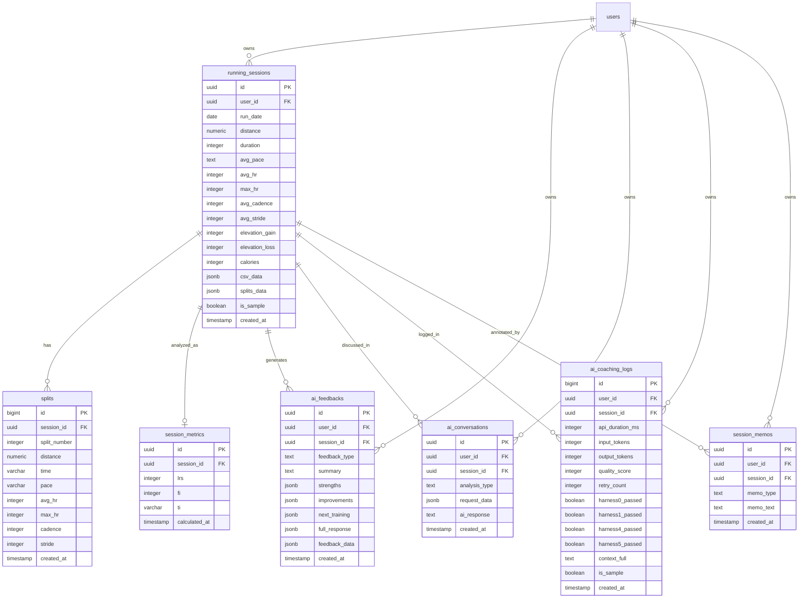

# ARCC Database ERD

**작성일**: 2026-05-01
**최종 갱신**: 2026-05-08 (D-031: session_memos 테이블 신설 - D-001 변경 6→7테이블)
**기준 커밋**: D-031 박제 커밋 (예정, 5/8 또는 다음 세션)
**Phase**: 3-7 complete + UX 진화 단계 진입
**스키마 출처**: Supabase `public` schema, `information_schema` 기반 자동 추출

---

## 📐 전체 구조 (Mermaid Diagram)



---

## 📋 테이블 요약

| 테이블 | 역할 | 컬럼 수 | row 예시 (2026-05-08 기준) |
|---|---|---|---|
| `running_sessions` | 러닝 세션 마스터 (부모) | 17 ✅ | 5 (5/6 회귀 +1) |
| `splits` | 구간별 데이터 (1km, 2km...) | 11 | 37 (5/6 회귀 +6) |
| `session_metrics` | 분석 지표 (LRS/FI/TI) | 6 ✅ | 5 (5/6 회귀 +1) |
| `ai_feedbacks` | 정형화된 코칭 카드 | 11 | 4 (5/6 회귀 +1) |
| `ai_conversations` | AI 대화 히스토리 (차별화 핵심) | 7 | 0 (D-028 차별점 미구현) |
| `ai_coaching_logs` | AI 호출 품질 모니터링 | 15 | 5 (5/6 회귀 +1 추정) |
| **`session_memos`** ⭐ 신규 | **사용자 메모 (D-031, 6/1 이후 활성화)** | **6** | **0 (구현 대기)** |

**총 컬럼 수**: 73 (Phase 3-7 B-1 후 67 + session_memos 6 = 73)
**총 테이블 수**: **7** (D-001 6테이블 → 7테이블 변경, D-031에 의해)

---

## 🌟 테이블별 상세

### 1. `running_sessions` (부모 테이블)

러닝 한 번 = 1 row. 모든 자식 테이블의 출발점.

| 컬럼 | 타입 | NULL | 설명 |
|---|---|---|---|
| **id** | uuid (PK) | NO | 세션 고유 ID (자동 생성) |
| **user_id** | uuid (FK→users) | YES | 누구의 러닝인지 |
| **run_date** | date | YES | 러닝 날짜 |
| **distance** | numeric | YES | 거리 (km) |
| **duration** | integer | YES | 운동 시간 (초) |
| **avg_pace** | text | YES | 평균 페이스 (예: "7:47") |
| **avg_hr** | integer | YES | 평균 심박 |
| **max_hr** | integer | YES | 최고 심박 |
| **avg_cadence** | integer | YES | 평균 케이던스 (spm) |
| **avg_stride** | integer | YES | 평균 보폭 |
| **elevation_gain** | integer | YES | 누적 상승 (m) |
| **elevation_loss** | integer | YES | 누적 하강 (m) |
| **calories** | integer | YES | 칼로리 |
| **csv_data** | jsonb | YES | 원본 CSV 전체 (백업용) |
| **splits_data** | jsonb | YES | 구간 데이터 (splits 테이블 보완용) |
| **is_sample** | boolean | YES | 샘플 데이터 여부 (default: false) |
| **created_at** | timestamp **without** tz | YES | 레코드 생성 시각 (default: now()) |

✅ **컬럼 중복 정리 완료** (Phase 3-7 B-1, 2026-05-02):
- `total_time_seconds` 제거 → `duration` 단일화
- `avg_heart_rate` 제거 → `avg_hr` 단일화
- `max_heart_rate` 제거 → `max_hr` 단일화
- `avg_stride_length` 제거 → `avg_stride` 단일화
- `avg_pace_seconds` 제거 (보너스) → `avg_pace` 단일화 ⭐
- 결과: 22→17 컬럼 (5개 감소)

⚠️ **시간 컬럼 일관성 위반** (Q-013, 5/6 발견): `created_at`이 timestamp **without** tz. 다른 테이블(ai_feedbacks, session_metrics, splits)은 with tz. 9월 런칭 전 통일 검토 필요.

---

### 2. `splits` (구간별 데이터)

CSV의 1km, 2km, ... 각 구간을 한 row씩.

| 컬럼 | 타입 | NULL | 설명 |
|---|---|---|---|
| **id** | bigint (PK, sequence) | NO | 자동 증가 ID ⚠️ Q-012 |
| **session_id** | uuid (FK→running_sessions) | NO | 부모 세션 |
| **split_number** | integer | NO | 구간 번호 (1, 2, 3...) |
| **distance** | numeric | YES | 구간 거리 (km) |
| **time** | varchar | YES | 구간 시간 ⚠️ Q-013 |
| **pace** | varchar | YES | 구간 페이스 |
| **avg_hr** | integer | YES | 구간 평균 심박 |
| **max_hr** | integer | YES | 구간 최고 심박 |
| **cadence** | integer | YES | 구간 케이던스 |
| **stride** | integer | YES | 구간 보폭 |
| **created_at** | timestamp **with** tz | YES | 생성 시각 |

✅ 컬럼 중복 없음. 깔끔.

⚠️ **타입 일관성 이슈** (5/6 발견):
- `id`가 bigint (다른 테이블 PK는 uuid) → Q-012
- `time`이 character varying (시간이 문자열로 저장) → Q-013

🔒 **RLS 정책**: `EXISTS (SELECT 1 FROM running_sessions ...)` 유지 (5/6 결정 D-029)
- user_id 컬럼 없어 단순화 불가
- EXISTS 정책은 정규화된 DB의 표준 RLS 패턴, 보안 효과 동일

---

### 3. `session_metrics` (분석 지표)

LRS / FI / TI 등 ARCC의 핵심 분석 결과.

| 컬럼 | 타입 | NULL | 설명 |
|---|---|---|---|
| **id** | uuid (PK) | NO | 분석 결과 ID |
| **session_id** | uuid (FK→running_sessions) | YES | 분석 대상 세션 |
| **lrs** | integer | YES | 페이스 안정도 (러닝 리듬 안정도, 0~100) |
| **fi** | integer | YES | 피로도 지수 (0~100) |
| **ti** | varchar | YES | 훈련 강도 (low/moderate/high/very_high) |
| **calculated_at** | timestamp **with** tz | YES | 계산 시각 ⚠️ Q-013 |

✅ **컬럼 중복 정리 완료** (Phase 3-7 B-1, 2026-05-02):
- `lrs_score` 제거 → `lrs` 단일화
- `fi_score` 제거 → `fi` 단일화
- `ti_level` 제거 → `ti` 단일화
- `hrs_score` 제거 (사용 흔적 없는 dead column)
- 결과: 10→6 컬럼 (4개 감소)

⚠️ **컬럼명 일관성 이슈** (Q-013, 5/6 발견): 다른 테이블의 `created_at`과 달리 `calculated_at`. 분석 시각이라는 의미 차이는 있지만 명명 규칙 통일 검토 필요.

🔒 **RLS 정책**: `EXISTS (SELECT 1 FROM running_sessions ...)` 유지 (5/6 결정 D-029)

---

### 4. `ai_feedbacks` (정형화된 코칭 카드)

화면 "다음 훈련 추천" 영역에 표시되는 데이터.

| 컬럼 | 타입 | NULL | 설명 |
|---|---|---|---|
| **id** | uuid (PK) | NO | 피드백 ID |
| **user_id** | uuid (FK→users) | NO | 소유 유저 |
| **session_id** | uuid (FK→running_sessions) | YES | 분석 대상 세션 |
| **feedback_type** | text | YES | 피드백 종류 (default: 'session') |
| **summary** | text | YES | 한 줄 요약 |
| **strengths** | jsonb | YES | 잘한 점 (구조화) |
| **improvements** | jsonb | YES | 개선점 (구조화) |
| **next_training** | jsonb | YES | 다음 훈련 추천 (구조화) ⭐ |
| **full_response** | jsonb | YES | AI 전체 응답 (백업) |
| **feedback_data** | jsonb | YES | 추가 메타데이터 |
| **created_at** | timestamp **with** tz | YES | 생성 시각 |

✅ 깔끔. 컬럼 중복 없음.
🌟 **ARCC 핵심 차별화 포인트**: 일반 ChatGPT는 텍스트 응답만 주지만, ARCC는 `next_training`을 **JSON 구조**로 저장 → 화면에 카드 형태로 깔끔 표시.

🔒 **RLS 정책** (Phase 3-7 B-5, 5/2 단순화 완료):
- `af_select_own`: `auth.uid() = user_id` (SELECT)
- `af_insert_own`: `auth.uid() = user_id` (INSERT WITH CHECK)
- `af_update_own`: `auth.uid() = user_id` (UPDATE USING + WITH CHECK)
- 변경 전: `EXISTS (SELECT 1 FROM running_sessions WHERE ...)` 서브쿼리 기반
- 변경 후: 직접 컬럼 비교 (성능 개선 + 가독성 향상)
- ⚠️ DELETE 정책 부재 (다른 테이블과 비대칭, 향후 검토 항목)

---

### 5. `ai_conversations` (AI 대화 히스토리)

ARCC의 가장 큰 차별화 포인트. 세션 메모리의 본진.

| 컬럼 | 타입 | NULL | 설명 |
|---|---|---|---|
| **id** | uuid (PK) | NO | 대화 ID |
| **user_id** | uuid (FK→users) | YES | 대화 소유자 |
| **session_id** | uuid (FK→running_sessions) | YES | 관련 러닝 세션 |
| **request_data** | jsonb | YES | 사용자 입력 + 컨텍스트 |
| **ai_response** | text | YES | AI 응답 본문 |
| **analysis_type** | text | YES | 분석 종류 (running_analysis 등) |
| **created_at** | timestamp **without** tz | YES | 생성 시각 ⚠️ Q-013 |

🌟 **ARCC의 진짜 무기**: ChatGPT의 단점(세션 메모리 없음)을 정면 돌파. 사용자별/세션별 대화 히스토리 영구 보존 → 누적된 코칭 데이터가 곧 사업 moat.

⏳ Phase 3-7 백로그 이관: `ai_feedbacks`와의 역할 명확화 필요 (B-2 항목, 다음 Phase로).

📝 **D-031 후 역할 명확화** (2026-05-08):
- session_memos = "사용자가 시스템에 남긴 메모" (즉시 활성화, 6/1)
- ai_conversations = "AI와 사용자 간 대화" (Level 1+2+3 시점 활성화)
- 두 테이블이 분리되어 각각 역할 단단해짐

🔒 **RLS 정책** (Phase 3-7 보완, 2026-05-06 / D-027):
- 5/6 점검 결과 RLS 활성화 상태이나 **정책 0개** 발견 (보안 구멍)
- 4종 정책 추가 완료 (BEGIN/COMMIT 트랜잭션, 멱등성 보장):
  - `ac_select_own`: `auth.uid() = user_id` (SELECT)
  - `ac_insert_own`: `auth.uid() = user_id` (INSERT WITH CHECK)
  - `ac_update_own`: `auth.uid() = user_id` (UPDATE USING + WITH CHECK)
  - `ac_delete_own`: `auth.uid() = user_id` (DELETE)
- 회귀 테스트 통과 (5/4 5.74km 데이터, 2026-05-06 21:00 KST)

⚠️ **차별점 미구현 인지** (D-028, 2026-05-06):
- row 0개 = INSERT 코드 미구현 상태
- 정책 인프라는 완비, 실제 활성화는 Q-001 D-022 Level 1 시작 시 본격
- ARCC 핵심 차별점인 "DB 누적 코칭 메모리"의 데이터 레벨 구현은 6월 이후

---

### 6. `ai_coaching_logs` (AI 호출 품질 모니터링) ⭐ 특허 핵심

매 AI 호출의 품질/성능을 추적. 비기능 모니터링 데이터.

| 컬럼 | 타입 | NULL | 설명 |
|---|---|---|---|
| **id** | bigint (PK, sequence) | NO | 자동 증가 ID |
| **user_id** | uuid (FK→users) | YES | 호출한 유저 |
| **session_id** | uuid (FK→running_sessions) | YES | 관련 세션 (NULL 가능 ⚠️) |
| **api_duration_ms** | integer | YES | API 호출 소요 시간 (ms) |
| **input_tokens** | integer | YES | 입력 토큰 수 |
| **output_tokens** | integer | YES | 출력 토큰 수 |
| **harness0_passed** | boolean | YES | Harness 0 통과 여부 |
| **harness1_passed** | boolean | YES | Harness 1 통과 여부 |
| **harness4_passed** | boolean | YES | Harness 4 통과 여부 |
| **harness5_passed** | boolean | YES | Harness 5 통과 여부 |
| **retry_count** | integer | YES | 재시도 횟수 (default: 0) |
| **quality_score** | integer | YES | 품질 점수 (0~100) |
| **context_full** | text | YES | 전체 프롬프트 |
| **is_sample** | boolean | YES | 샘플 여부 (default: false) |
| **created_at** | timestamp | YES | 호출 시각 |

🌟 **특허 출원 핵심 자료**: AI 응답의 품질을 시스템적으로 검증하는 다단계 하네스(harness) 구조 + 토큰/지연 통계 → 의료/공공 도입 시 신뢰성 입증 자료.

📝 **D-031 변경 1.4 시너지** (2026-05-08): 분석 진행 중 3단계 표시 (① 데이터 정리 → ② 분석 → ③ 코칭 생성)가 본 테이블의 harness 단계와 자연스럽게 연결. 사용자 UX = 백엔드 단계 시각화.

✅ Phase 3-7 C-1 완료: NULL session_id 발생 0건 재발 없음, 안전장치 의도대로 동작 확정 (2026-05-01).

---

### 7. `session_memos` (사용자 메모) ⭐ 신규 (D-031, 2026-05-08)

사용자가 러닝 세션에 대해 남긴 메모. ARCC 차별점 활성화의 첫 트랙.

| 컬럼 | 타입 | NULL | 설명 |
|---|---|---|---|
| **id** | uuid (PK) | NO | 메모 고유 ID (gen_random_uuid()) |
| **user_id** | uuid (FK→users) | NO | 메모 작성자 |
| **session_id** | uuid (FK→running_sessions) | NO | 관련 러닝 세션 |
| **memo_type** | text | YES | 메모 유형 (default: 'general') |
| **memo_text** | text | NO | 메모 본문 (200자 제한) |
| **created_at** | timestamp **with** tz | YES | 작성 시각 (default: now()) |

**memo_type 후보값**: `'general'` (기본), `'injury'` (부상), `'condition'` (컨디션), `'environment'` (환경)

🌟 **ARCC 차별점 활성화** (D-022, D-028과 시너지):
- ai_conversations와 별도로 사용자 발화 누적
- D-028 (차별점 미구현)과 별개 트랙으로 즉시 활성화 가능
- 6/1 영상 콘텐츠 시작 시점에 차별점 데이터 누적 시작

📝 **제이슨 철학** (2026-05-08): "메모 전용 테이블 = 역할 단단"
- 단일 책임 원칙 (Single Responsibility) 적용
- ai_conversations와 명확히 분리:
  - session_memos = 사용자가 시스템에 남기는 메모
  - ai_conversations = AI와 사용자 간 대화

🔒 **RLS 정책** (D-031, D-027 패턴 동일):
- `sm_select_own`: `auth.uid() = user_id` (SELECT)
- `sm_insert_own`: `auth.uid() = user_id` (INSERT WITH CHECK)
- `sm_update_own`: `auth.uid() = user_id` (UPDATE USING + WITH CHECK)
- `sm_delete_own`: `auth.uid() = user_id` (DELETE)

🎯 **D-031 변경 2 결정 종합**:

| 결정 | 내용 |
|---|---|
| 2.1 저장 위치 | session_memos 신규 테이블 (옵션 C) |
| 2.2 컬럼 구조 | 6개 컬럼 (위 표) |
| 2.3 문자수 | 200자 |
| 2.4 필수/선택 | 선택 (빈 메모 OK) |
| 2.5 입력 시점 | 분석 전 + 결과 화면 추가 |
| 2.6 표시 위치 | 결과 화면 하단 이력 목록 |

📋 **마이그레이션 SQL** (D-018 단계 2):
```sql
-- 1. 테이블 생성
CREATE TABLE session_memos (
  id uuid PRIMARY KEY DEFAULT gen_random_uuid(),
  user_id uuid REFERENCES users(id) NOT NULL,
  session_id uuid REFERENCES running_sessions(id) NOT NULL,
  memo_type text DEFAULT 'general',
  memo_text text NOT NULL,
  created_at timestamp with time zone DEFAULT now()
);

-- 2. RLS 활성화
ALTER TABLE session_memos ENABLE ROW LEVEL SECURITY;

-- 3. RLS 정책 4종 (멱등성 보장)
DROP POLICY IF EXISTS sm_select_own ON session_memos;
CREATE POLICY sm_select_own ON session_memos
  FOR SELECT USING (auth.uid() = user_id);

DROP POLICY IF EXISTS sm_insert_own ON session_memos;
CREATE POLICY sm_insert_own ON session_memos
  FOR INSERT WITH CHECK (auth.uid() = user_id);

DROP POLICY IF EXISTS sm_update_own ON session_memos;
CREATE POLICY sm_update_own ON session_memos
  FOR UPDATE USING (auth.uid() = user_id)
  WITH CHECK (auth.uid() = user_id);

DROP POLICY IF EXISTS sm_delete_own ON session_memos;
CREATE POLICY sm_delete_own ON session_memos
  FOR DELETE USING (auth.uid() = user_id);

-- 4. 인덱스 (성능)
CREATE INDEX idx_session_memos_session_id ON session_memos(session_id);
CREATE INDEX idx_session_memos_user_id ON session_memos(user_id);
```

⏳ **활성화 시점**: 6/1 변경 1+2+3 구현 후

---

## 🔗 외래 키(FK) 전체 매핑

| 자식 테이블 | 자식 컬럼 | → | 부모 테이블 | 부모 컬럼 |
|---|---|---|---|---|
| running_sessions | user_id | → | users | id |
| splits | session_id | → | running_sessions | id |
| session_metrics | session_id | → | running_sessions | id |
| ai_feedbacks | user_id | → | users | id |
| ai_feedbacks | session_id | → | running_sessions | id |
| ai_conversations | user_id | → | users | id |
| ai_conversations | session_id | → | running_sessions | id |
| ai_coaching_logs | user_id | → | users | id |
| ai_coaching_logs | session_id | → | running_sessions | id |
| **session_memos** ⭐ | **user_id** | → | users | id |
| **session_memos** ⭐ | **session_id** | → | running_sessions | id |

**총 11개 FK 관계** (기존 9개 + session_memos 2개).
- `running_sessions.id` 참조: 6개 (splits, session_metrics, ai_feedbacks, ai_conversations, ai_coaching_logs, **session_memos**)
- `users.id` 참조: 5개 (running_sessions, ai_feedbacks, ai_conversations, ai_coaching_logs, **session_memos**)

---

## 🔒 RLS 정책 요약

| 테이블 | 정책 방식 | 비고 |
|---|---|---|
| `running_sessions` | `auth.uid() = user_id` (직접 비교) | 단순 |
| `splits` | `EXISTS (SELECT 1 FROM running_sessions ...)` | user_id 컬럼 없어 EXISTS 유지 (D-029) |
| `session_metrics` | `EXISTS (SELECT 1 FROM running_sessions ...)` | user_id 컬럼 없어 EXISTS 유지 (D-029) |
| `ai_feedbacks` | `auth.uid() = user_id` (직접 비교) ✅ | Phase 3-7 B-5에서 단순화 (2026-05-02) |
| `ai_conversations` | `auth.uid() = user_id` (직접 비교) ✅ | Phase 3-7 보완 (2026-05-06): 정책 0개 발견 → 4종 추가 (D-027) |
| `ai_coaching_logs` | `auth.uid() = user_id` (직접 비교) | 단순 |
| **`session_memos`** ⭐ 신규 | **`auth.uid() = user_id` (직접 비교)** | **D-031, D-027 패턴 동일 (4종 정책)** |

---

## ✅ Phase 3-7 정리 완료 요약

### B-1: 컬럼 중복 정리 ✅ 완료 (2026-05-02)

**running_sessions (5개 DROP)**
- [x] `total_time_seconds` 제거 → `duration` 단일화
- [x] `avg_heart_rate` 제거 → `avg_hr` 단일화
- [x] `max_heart_rate` 제거 → `max_hr` 단일화
- [x] `avg_stride_length` 제거 → `avg_stride` 단일화
- [x] `avg_pace_seconds` 제거 → `avg_pace` 단일화

**session_metrics (4개 DROP)**
- [x] `lrs_score` 제거 → `lrs` 단일화
- [x] `fi_score` 제거 → `fi` 단일화
- [x] `ti_level` 제거 → `ti` 단일화
- [x] `hrs_score` 제거 (dead column)

**결과**: 9개 컬럼 감소 (running_sessions 22→17, session_metrics 10→6)

### B-3: 트랜잭션 묶음 ✅ 완료 (2026-05-01, 커밋 1b3bc13)

- [x] PostgreSQL RPC 함수 `insert_session_bundle` (SECURITY INVOKER) 생성
- [x] `running_sessions` + `splits` + `session_metrics` 3개 테이블 단일 트랜잭션
- [x] AI 호출(15초+)은 트랜잭션 밖에 배치
- [x] 의도 실패 시 자동 ROLLBACK 검증 통과 (22P02 에러)

⏳ **D-031 후 검토** (2026-05-08): session_memos는 트랜잭션 묶음 대상 X (메모 입력 = 별도 작업 흐름).

### B-4: ORDER BY 명시화 ✅ 완료 (2026-05-02)

- [x] `context_builder.py:102`에 보조 정렬 키 `created_at DESC` 추가
- 백로그 3건: `main.py:329`, `context_builder.py:50`, `__init__.py:137` (id DESC 보조 키, health_records 측 권장 — 다음 Phase 이관)

### B-5: RLS 정책 단순화 ✅ 완료 (2026-05-02 / 2026-05-06 보완)

**5/2 작업**:
- [x] `ai_feedbacks` 정책 3개 (af_select_own, af_insert_own, af_update_own)
- [x] `EXISTS` 서브쿼리 → `auth.uid() = user_id` 단순 비교 전환
- [x] `splits`, `session_metrics`는 `user_id` 컬럼 없어 EXISTS 유지 (의도)

**5/6 보완 작업** (D-027/D-028/D-029):
- [x] 6개 테이블 RLS 전수 점검 (정찰)
- [x] `ai_conversations` 정책 0개 발견 → 4종 추가 (D-027)
  - ac_select_own / ac_insert_own / ac_update_own / ac_delete_own
- [x] `splits` + `session_metrics` 단순화 포기 결정 (D-029)
  - 이유: user_id 컬럼 없음 → 비정규화 + 마이그레이션 + 회귀 위험
  - EXISTS 정책은 정규화된 DB의 표준 RLS 패턴, 보안 효과 동일
- [x] 회귀 테스트 통과 (2026-05-06, 5/4 5.74km 데이터)
- [x] DB 정합성 검증 100% 일치
  - running_sessions: +1 (5/4 분석)
  - splits: +6 (1km~6km)
  - session_metrics: +1
  - ai_feedbacks: +1
  - ai_conversations: 0 (D-028 차별점 미구현 재확인)

### C-1: NULL session_id 진단 ✅ 완료 (2026-05-01)

- [x] 0건 재발 없음, 안전장치 의도대로 동작 확정

### B-2: 테이블 역할 정리 ✅ D-031로 부분 해소 (2026-05-08)

- [x] `session_memos` 신설로 사용자 메모와 AI 대화 분리됨
- [ ] `ai_feedbacks` vs `ai_conversations` 역할 명확화 → 다음 Phase 이관

---

**Phase 3-7 결과**: 12/14 완료 (D-031로 13/14에 가까워짐). ARCC DB 스키마 정상화 + 보안 정책 최적화 + ACID 보장 달성 + ai_conversations 정책 보완 + session_memos 신설 준비.

---

## 🆕 D-031 진행 상황 (2026-05-08)

### 변경 1: [ARCC 분석 시작] 버튼 (5건 결정, 2026-05-07)
- 5건 모두 결정 완료
- 코드 변경 사항 (DB 영향 없음)
- 6/1 구현 예정

### 변경 2: 메모란 + session_memos (6건 결정, 2026-05-08)
- 6건 모두 결정 완료
- **DB 변경 동반** (D-001 6→7 테이블)
- D-018 7단계 적용 대상
- 마이그레이션 SQL 초안 작성 완료 (위 섹션 참조)

### 변경 3: 프롬프트 러닝 제한 (3건 결정, 2026-05-08)
- 3건 모두 결정 완료 (시스템 프롬프트 + 통증 응답 패턴)
- 코드 변경 사항 (DB 영향 없음)
- 6/1 구현 시 시스템 프롬프트 작성 (Q-017)

### 박제 상태
- D-031 본문 초안 작성 완료 (`/home/claude/D-031_draft.md`, 288줄)
- DECISIONS.md 통합 + GitHub 커밋 = 다음 세션
- ERD.md 갱신 (본 문서) = 다음 세션 또는 D-031 박제 시

---

## ❓ Open Questions (5/6, 5/8 발견)

### Q-012: splits.id 타입 불일치
- 다른 테이블 PK는 모두 `uuid` 타입
- `splits.id`만 `bigint` 타입 (sequence 자동 증가)
- 의도된 설계인지 실수인지 확인 필요
- 처리: 9월 런칭 전 검토

### Q-013: 시간 컬럼 일관성 위반
- timestamp **without** time zone: `ai_conversations`, `running_sessions`
- timestamp **with** time zone: `ai_feedbacks`, `session_metrics`, `splits`, **`session_memos` (신규, with tz)** ⭐
- 컬럼명 불일치: `session_metrics`만 `calculated_at`, 나머지 `created_at`
- `splits.time`이 character varying (시간이 문자열로 저장)
- 처리: 9월 런칭 전 통일 검토

### Q-014: 메모 수정/삭제 정책 ⭐ 신규 (D-031 파생)
- 메모 입력 후 수정 가능?
- 메모 삭제 가능?
- 잘못 입력한 메모 처리?
- RLS 정책에 update/delete는 활성화되어 있으나 UI 미정
- 처리: D-031 박제 후 또는 6/1 구현 시 결정

### Q-015: memo_type 후보값 확정 ⭐ 신규 (D-031 파생)
- 현재 4개 (general/injury/condition/environment)
- 충분한가? 추가 필요한가? (예: 'recovery', 'goal', 'reflection')
- 사용자가 직접 추가 가능?
- 처리: 7월 사용 패턴 보고 결정

### Q-016: 무한 재분석 방지 ⭐ 신규 (D-031 파생)
- 변경 1.5 (재분석)에서 사용자가 메모만 살짝 바꿔서 무한 재분석 → API 비용 폭증 위험
- 1러닝당 재분석 최대 횟수 제한? (3회?)
- 또는 [정말 재분석?] 확인 다이얼로그?
- 또는 무제한 (B2C 유료 모델로 제어)?
- 처리: 6/1 구현 시 결정 또는 본격 운영 후 데이터 보고

### Q-017: 시스템 프롬프트 실제 문구 ⭐ 신규 (D-031 파생)
- 변경 3.1 (시스템 프롬프트 명시) 결정 완료
- 실제 문구는 6/1 구현 시 작성
- 통증 응답 패턴 (인지 → 강도 조절 → 전문의 상담) 명시
- 진료과 자동 지정 금지 (5/8 제이슨 교정)
- 처리: 6/1 구현 시 작성 + 다듬기

---

## 📚 참고: ERD 갱신 방법

**스키마 변경 시 이 문서도 업데이트하려면:**

1. Supabase SQL Editor에서 아래 SQL 실행:
   ```sql
   -- (이 문서 작성에 사용된 동일한 SQL)
   SELECT c.table_name, c.column_name, c.data_type, c.is_nullable, c.column_default,
     CASE
       WHEN tc.constraint_type = 'PRIMARY KEY' THEN 'PK'
       WHEN tc.constraint_type = 'FOREIGN KEY' THEN 'FK → ' || ccu.table_name || '.' || ccu.column_name
       ELSE ''
     END AS key_info
   FROM information_schema.columns c
   LEFT JOIN information_schema.key_column_usage kcu
     ON c.table_name = kcu.table_name AND c.column_name = kcu.column_name
   LEFT JOIN information_schema.table_constraints tc
     ON kcu.constraint_name = tc.constraint_name
     AND tc.constraint_type IN ('PRIMARY KEY', 'FOREIGN KEY')
   LEFT JOIN information_schema.constraint_column_usage ccu
     ON tc.constraint_name = ccu.constraint_name
     AND tc.constraint_type = 'FOREIGN KEY'
   WHERE c.table_schema = 'public'
     AND c.table_name IN ('running_sessions', 'splits', 'session_metrics',
                          'ai_feedbacks', 'ai_conversations', 'ai_coaching_logs',
                          'session_memos')
   ORDER BY c.table_name, c.ordinal_position;
   ```
2. CSV Export → 변경분만 이 문서에 반영
3. Git 커밋 메시지: `docs: Update ERD (스키마 변경 사유)`

---

**문서 종료** | 다음 갱신 예정: D-031 운영 적용 후 (session_memos 실제 row 누적 시점) 또는 Phase 3-8 (B-2 ai_feedbacks 역할 정리 후)
