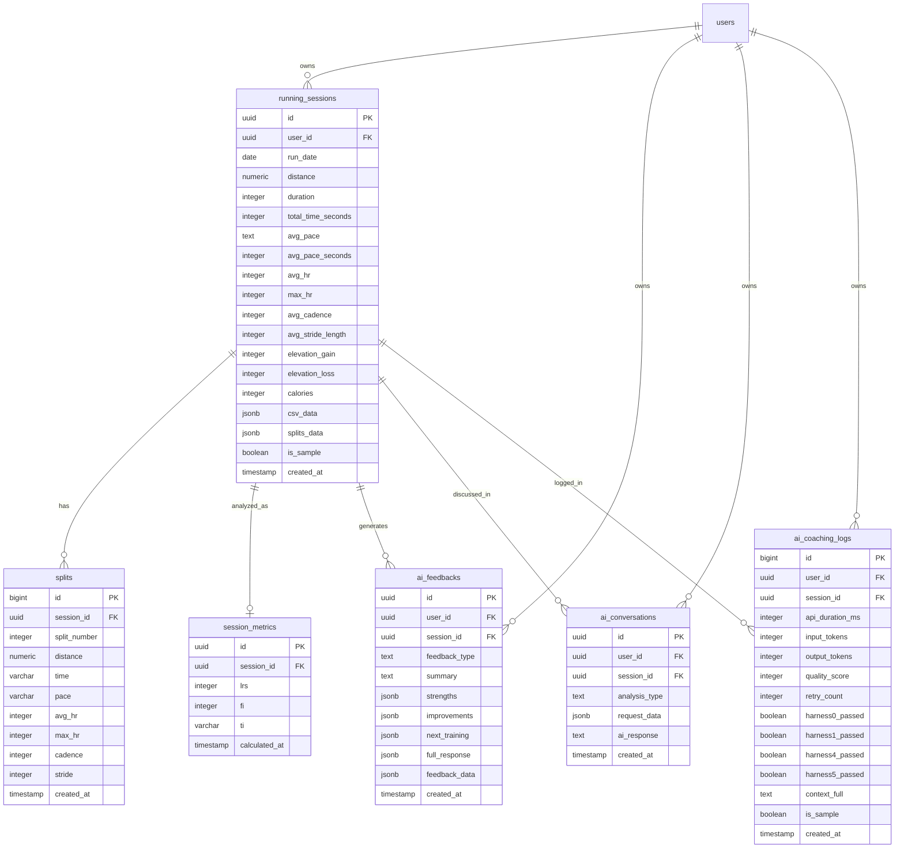

# ARCC Database ERD

**작성일**: 2026-05-01
**기준 커밋**: e40af44 (Phase 3-3 complete)
**Phase**: 3-7 in progress
**스키마 출처**: Supabase `public` schema, `information_schema` 기반 자동 추출

---

## 📐 전체 구조 (Mermaid Diagram)



---

## 📋 테이블 요약

| 테이블 | 역할 | 컬럼 수 | row 예시 (Phase 3-3 완료 시점) |
|---|---|---|---|
| `running_sessions` | 러닝 세션 마스터 (부모) | 22 (4쌍 중복 ⚠️) | 2 |
| `splits` | 구간별 데이터 (1km, 2km...) | 11 | 11 |
| `session_metrics` | 분석 지표 (LRS/FI/TI) | 10 (3쌍 중복 ⚠️) | 2 |
| `ai_feedbacks` | 정형화된 코칭 카드 | 11 | 1 |
| `ai_conversations` | AI 대화 히스토리 (차별화 핵심) | 7 | 0 |
| `ai_coaching_logs` | AI 호출 품질 모니터링 | 15 | 2 |

---

## 🌟 테이블별 상세

### 1. `running_sessions` (부모 테이블)

러닝 한 번 = 1 row. 모든 자식 테이블의 출발점.

| 컬럼 | 타입 | NULL | 설명 |
|---|---|---|---|
| **id** | uuid (PK) | NO | 세션 고유 ID (자동 생성) |
| **user_id** | uuid (FK→users) | YES | 누구의 러닝인지 |
| **run_date** | date | YES | 러닝 날짜 |
| **distance** | numeric | YES | 거리 (km) |
| **duration** ⚠️ | integer | YES | 운동 시간 (초) — `total_time_seconds`와 중복 |
| **total_time_seconds** ⚠️ | integer | YES | 운동 시간 (초) — `duration`과 중복 |
| **avg_pace** | text | YES | 평균 페이스 (예: "7:47") |
| **avg_pace_seconds** | integer | YES | 평균 페이스 (초 단위 변환) |
| **avg_hr** ⚠️ | integer | YES | 평균 심박 — `avg_heart_rate`와 중복 |
| **avg_heart_rate** ⚠️ | integer | YES | 평균 심박 — `avg_hr`와 중복 |
| **max_hr** ⚠️ | integer | YES | 최고 심박 — `max_heart_rate`와 중복 |
| **max_heart_rate** ⚠️ | integer | YES | 최고 심박 — `max_hr`와 중복 |
| **avg_cadence** | integer | YES | 평균 케이던스 (spm) |
| **avg_stride_length** ⚠️ | integer | YES | 평균 보폭 — `avg_stride`와 중복 |
| **avg_stride** ⚠️ | integer | YES | 평균 보폭 — `avg_stride_length`와 중복 |
| **elevation_gain** | integer | YES | 누적 상승 (m) |
| **elevation_loss** | integer | YES | 누적 하강 (m) |
| **calories** | integer | YES | 칼로리 |
| **csv_data** | jsonb | YES | 원본 CSV 전체 (백업용) |
| **splits_data** | jsonb | YES | 구간 데이터 (splits 테이블 보완용) |
| **is_sample** | boolean | YES | 샘플 데이터 여부 (default: false) |
| **created_at** | timestamp | YES | 레코드 생성 시각 (default: now()) |

⚠️ **컬럼 중복 4쌍** (Phase 3-7 B-1 정리 항목):
- `duration` ↔ `total_time_seconds`
- `avg_hr` ↔ `avg_heart_rate`
- `max_hr` ↔ `max_heart_rate`
- `avg_stride` ↔ `avg_stride_length`

---

### 2. `splits` (구간별 데이터)

CSV의 1km, 2km, ... 각 구간을 한 row씩.

| 컬럼 | 타입 | NULL | 설명 |
|---|---|---|---|
| **id** | bigint (PK, sequence) | NO | 자동 증가 ID |
| **session_id** | uuid (FK→running_sessions) | NO | 부모 세션 |
| **split_number** | integer | NO | 구간 번호 (1, 2, 3...) |
| **distance** | numeric | YES | 구간 거리 (km) |
| **time** | varchar | YES | 구간 시간 |
| **pace** | varchar | YES | 구간 페이스 |
| **avg_hr** | integer | YES | 구간 평균 심박 |
| **max_hr** | integer | YES | 구간 최고 심박 |
| **cadence** | integer | YES | 구간 케이던스 |
| **stride** | integer | YES | 구간 보폭 |
| **created_at** | timestamp | YES | 생성 시각 |

✅ 컬럼 중복 없음. 깔끔.

---

### 3. `session_metrics` (분석 지표)

LRS / FI / TI 등 ARCC의 핵심 분석 결과.

| 컬럼 | 타입 | NULL | 설명 |
|---|---|---|---|
| **id** | uuid (PK) | NO | 분석 결과 ID |
| **session_id** | uuid (FK→running_sessions) | YES | 분석 대상 세션 |
| **lrs** ⚠️ | integer | YES | 페이스 안정도 — `lrs_score`와 중복 |
| **lrs_score** ⚠️ | numeric | YES | 페이스 안정도 — `lrs`와 중복 |
| **fi** ⚠️ | integer | YES | 피로도 지수 — `fi_score`와 중복 |
| **fi_score** ⚠️ | numeric | YES | 피로도 지수 — `fi`와 중복 |
| **ti** ⚠️ | varchar | YES | 훈련 강도 — `ti_level`과 중복 |
| **ti_level** ⚠️ | text | YES | 훈련 강도 — `ti`와 중복 |
| **hrs_score** ❓ | numeric | YES | Heart Rate Score? (사용 여부 불명) |
| **calculated_at** | timestamp | YES | 계산 시각 |

⚠️ **컬럼 중복 3쌍** + ❓ **사용 안 하는 컬럼 1개** (Phase 3-7 B-1 추가 발견):
- `lrs` ↔ `lrs_score`
- `fi` ↔ `fi_score`
- `ti` ↔ `ti_level`
- `hrs_score` (역할 불명, 정리 필요)

---

### 4. `ai_feedbacks` (정형화된 코칭 카드)

화면 "다음 훈련 추천" 영역에 표시되는 데이터.

| 컬럼 | 타입 | NULL | 설명 |
|---|---|---|---|
| **id** | uuid (PK) | NO | 피드백 ID |
| **user_id** | uuid (FK→users) | NO | 소유 유저 |
| **session_id** | uuid (FK→running_sessions) | YES | 분석 대상 세션 |
| **feedback_type** | text | YES | 피드백 종류 (default: 'session') |
| **summary** | text | YES | 한 줄 요약 |
| **strengths** | jsonb | YES | 잘한 점 (구조화) |
| **improvements** | jsonb | YES | 개선점 (구조화) |
| **next_training** | jsonb | YES | 다음 훈련 추천 (구조화) ⭐ |
| **full_response** | jsonb | YES | AI 전체 응답 (백업) |
| **feedback_data** | jsonb | YES | 추가 메타데이터 |
| **created_at** | timestamp | YES | 생성 시각 |

✅ 깔끔. 컬럼 중복 없음.
🌟 **ARCC 핵심 차별화 포인트**: 일반 ChatGPT는 텍스트 응답만 주지만, ARCC는 `next_training`을 **JSON 구조**로 저장 → 화면에 카드 형태로 깔끔 표시.

---

### 5. `ai_conversations` (AI 대화 히스토리)

ARCC의 가장 큰 차별화 포인트. 세션 메모리의 본진.

| 컬럼 | 타입 | NULL | 설명 |
|---|---|---|---|
| **id** | uuid (PK) | NO | 대화 ID |
| **user_id** | uuid (FK→users) | YES | 대화 소유자 |
| **session_id** | uuid (FK→running_sessions) | YES | 관련 러닝 세션 |
| **request_data** | jsonb | YES | 사용자 입력 + 컨텍스트 |
| **ai_response** | text | YES | AI 응답 본문 |
| **analysis_type** | text | YES | 분석 종류 (running_analysis 등) |
| **created_at** | timestamp | YES | 생성 시각 |

🌟 **ARCC의 진짜 무기**: ChatGPT의 단점(세션 메모리 없음)을 정면 돌파. 사용자별/세션별 대화 히스토리 영구 보존 → 누적된 코칭 데이터가 곧 사업 moat.

⚠️ Phase 3-7 점검: `ai_feedbacks`와의 역할 명확화 필요 (B-2 항목).

---

### 6. `ai_coaching_logs` (AI 호출 품질 모니터링) ⭐ 특허 핵심

매 AI 호출의 품질/성능을 추적. 비기능 모니터링 데이터.

| 컬럼 | 타입 | NULL | 설명 |
|---|---|---|---|
| **id** | bigint (PK, sequence) | NO | 자동 증가 ID |
| **user_id** | uuid (FK→users) | YES | 호출한 유저 |
| **session_id** | uuid (FK→running_sessions) | YES | 관련 세션 (NULL 가능 ⚠️) |
| **api_duration_ms** | integer | YES | API 호출 소요 시간 (ms) |
| **input_tokens** | integer | YES | 입력 토큰 수 |
| **output_tokens** | integer | YES | 출력 토큰 수 |
| **harness0_passed** | boolean | YES | Harness 0 통과 여부 |
| **harness1_passed** | boolean | YES | Harness 1 통과 여부 |
| **harness4_passed** | boolean | YES | Harness 4 통과 여부 |
| **harness5_passed** | boolean | YES | Harness 5 통과 여부 |
| **retry_count** | integer | YES | 재시도 횟수 (default: 0) |
| **quality_score** | integer | YES | 품질 점수 (0~100) |
| **context_full** | text | YES | 전체 프롬프트 |
| **is_sample** | boolean | YES | 샘플 여부 (default: false) |
| **created_at** | timestamp | YES | 호출 시각 |

🌟 **특허 출원 핵심 자료**: AI 응답의 품질을 시스템적으로 검증하는 다단계 하네스(harness) 구조 + 토큰/지연 통계 → 의료/공공 도입 시 신뢰성 입증 자료.

⚠️ Phase 3-7 점검: NULL session_id 발생 원인 추적 (C-1 항목).

---

## 🔗 외래 키(FK) 전체 매핑

| 자식 테이블 | 자식 컬럼 | → | 부모 테이블 | 부모 컬럼 |
|---|---|---|---|---|
| running_sessions | user_id | → | users | id |
| splits | session_id | → | running_sessions | id |
| session_metrics | session_id | → | running_sessions | id |
| ai_feedbacks | user_id | → | users | id |
| ai_feedbacks | session_id | → | running_sessions | id |
| ai_conversations | user_id | → | users | id |
| ai_conversations | session_id | → | running_sessions | id |
| ai_coaching_logs | user_id | → | users | id |
| ai_coaching_logs | session_id | → | running_sessions | id |

**총 9개 FK 관계.** 모든 자식 테이블이 `running_sessions.id`를 참조 (`splits`, `session_metrics`, `ai_feedbacks`, `ai_conversations`, `ai_coaching_logs` = 5개) + `users.id` 참조 (4개).

---

## ⚠️ Phase 3-7 정리 대상 요약

이번 ERD 작업으로 발견한 정리 항목들:

### B-1: 컬럼 중복 정리 (총 7쌍 + 1개)

**running_sessions (4쌍)**
- [ ] `duration` ↔ `total_time_seconds`
- [ ] `avg_hr` ↔ `avg_heart_rate`
- [ ] `max_hr` ↔ `max_heart_rate`
- [ ] `avg_stride` ↔ `avg_stride_length`

**session_metrics (3쌍 + 1)** ⭐ 신규 발견
- [ ] `lrs` ↔ `lrs_score`
- [ ] `fi` ↔ `fi_score`
- [ ] `ti` ↔ `ti_level`
- [ ] `hrs_score` (사용 여부 불명, 역할 확인 필요)

### B-2: 테이블 역할 정리

- [ ] `ai_feedbacks` vs `ai_conversations` 역할 명확화 + 문서화

### C-1: 데이터 무결성 추적

- [ ] `ai_coaching_logs.session_id` NULL 발생 원인 추적

### B-3: 트랜잭션 묶음 (오늘 진행 예정)

- [ ] `running_sessions` + `splits` + `session_metrics` + `ai_feedbacks` + `ai_coaching_logs` 한 트랜잭션으로 묶기

---

## 📚 참고: ERD 갱신 방법

**스키마 변경 시 이 문서도 업데이트하려면:**

1. Supabase SQL Editor에서 아래 SQL 실행:
   ```sql
   -- (이 문서 작성에 사용된 동일한 SQL)
   SELECT c.table_name, c.column_name, c.data_type, c.is_nullable, c.column_default,
     CASE
       WHEN tc.constraint_type = 'PRIMARY KEY' THEN 'PK'
       WHEN tc.constraint_type = 'FOREIGN KEY' THEN 'FK → ' || ccu.table_name || '.' || ccu.column_name
       ELSE ''
     END AS key_info
   FROM information_schema.columns c
   LEFT JOIN information_schema.key_column_usage kcu
     ON c.table_name = kcu.table_name AND c.column_name = kcu.column_name
   LEFT JOIN information_schema.table_constraints tc
     ON kcu.constraint_name = tc.constraint_name
     AND tc.constraint_type IN ('PRIMARY KEY', 'FOREIGN KEY')
   LEFT JOIN information_schema.constraint_column_usage ccu
     ON tc.constraint_name = ccu.constraint_name
     AND tc.constraint_type = 'FOREIGN KEY'
   WHERE c.table_schema = 'public'
     AND c.table_name IN ('running_sessions', 'splits', 'session_metrics',
                          'ai_feedbacks', 'ai_conversations', 'ai_coaching_logs')
   ORDER BY c.table_name, c.ordinal_position;
   ```
2. CSV Export → 변경분만 이 문서에 반영
3. Git 커밋 메시지: `docs: Update ERD (스키마 변경 사유)`

---

**문서 종료** | 다음 갱신 예정: Phase 3-7 B-1 컬럼 중복 정리 후
